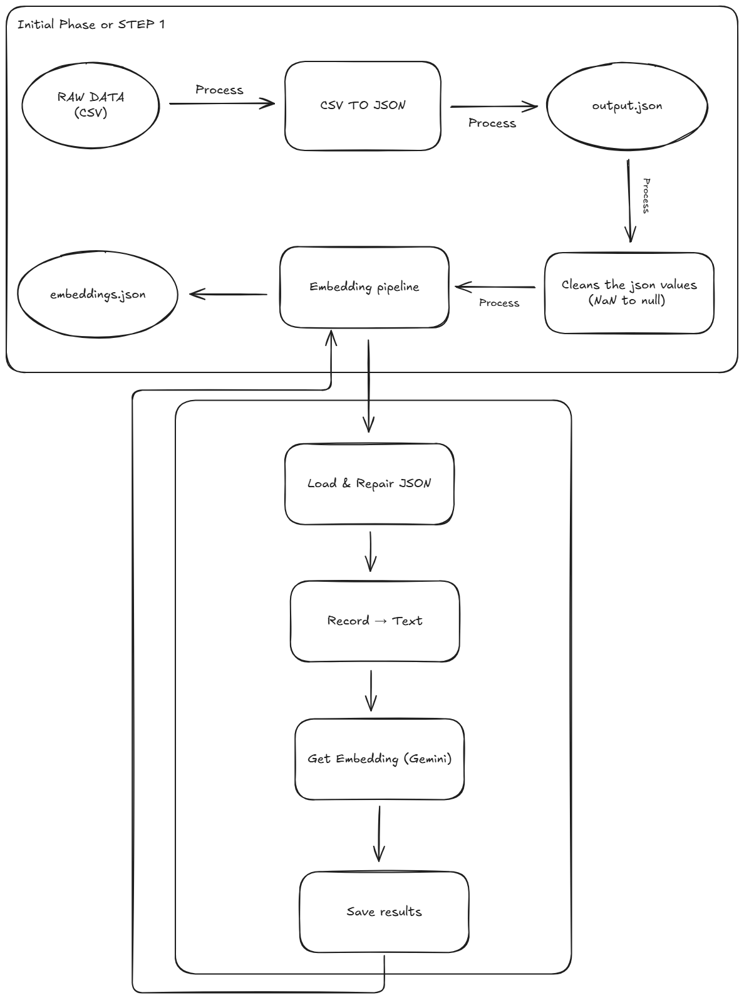

# AI Chatbot Proof of Concept: End-to-End Data Pipeline

This repository contains a Proof of Concept (POC) demonstrating a complete data preparation and database setup pipeline. The goal is to take raw data from a CSV file, convert it into vector embeddings, and load it into a cloud vector database, making it ready for use in an AI chatbot or semantic search application.

The primary technologies used are **Python**, **Pandas**, the **Google Gemini API**, and **MongoDB Atlas** for vector search.

---

## High-Level Workflow



The entire process is broken down into the following stages:

1.  **Convert CSV to JSON**: The initial `original.csv` data is converted into a more flexible `output.json` format.
2.  **Clean JSON Data**: The raw JSON is cleaned by replacing non-standard `NaN` values with the valid JSON `null` token.
3.  **Generate Embeddings**: The cleaned text data is sent to the Google Gemini API (`text-embedding-004` model) to generate vector embeddings.
4.  **Set Up Cloud Database**: A free-tier MongoDB Atlas cluster is deployed and configured.
5.  **Import Data & Create Index**: The generated JSON files are imported into the database and a vector search index is created to enable semantic querying.

---

## STEP 1 & 2: Data Preparation (CSV to Embeddings)

This phase covers converting the source CSV file into a clean, embedding-rich JSON file. There are two methods to accomplish this.

### Method 1: Google Colab (Quickstart)

This method is ideal for quick testing without any local setup. The entire pipeline is encapsulated in a single script.

*   **Instructions**: The full script and setup guide are in the `STEP 1/google_collab_implementation` directory.
*   **Public Colab Link**: You can run the pipeline directly via this [Google Colab Notebook](https://colab.research.google.com/drive/1_y-uXGNMpdQCpXXPoNmpOo6P1e_5Osno?usp=sharing).

### Method 2: VS Code (Local Development)

This method uses a structured, multi-script approach for local development.

*   **Instructions**: The scripts and a detailed setup guide are in the `STEP 1/vscode_implementation` directory.
*   **Process**:
    1.  `1_convert_csv.py`: Converts CSV to raw JSON.
    2.  `2_clean_json.py`: Cleans the raw JSON (`NaN` -> `null`).
    3.  `3_generate_embeddings.py`: Generates embeddings from the clean JSON.

---

## STEP 3: Database Setup (MongoDB Atlas)

This phase covers setting up the cloud vector database to store and query the data.

### Part 1: Prerequisite Setup

This step guides you through creating a free MongoDB Atlas account and cluster, with specific recommendations for users in Malaysia to ensure optimal performance.

*   **Detailed Guide**: [See the full prerequisite setup guide](./STEP%203/prerequisite_setup/README.md)

### Part 2: Full Setup and Data Import

This step guides you through connecting to your database, importing the `documents` and `embeddings` JSON files, and creating the crucial vector search index.

*   **Detailed Guide**: [See the full setup and indexing guide](./STEP%203/full_setup/README.md)

---

## Final Output

The final output of this pipeline is a fully configured MongoDB Atlas collection containing documents with the following structure, ready for semantic search:

```json
{
  "id": 0,
  "text": "Production Year: 1995 | Operator: Buffalo China, Inc. | ...",
  "vector": [-0.0035, 0.0684, ...],
  "metadata": {
    "year": 1995,
    "operator": "Buffalo China, Inc.",
    "county": "Erie"
  }
}
```